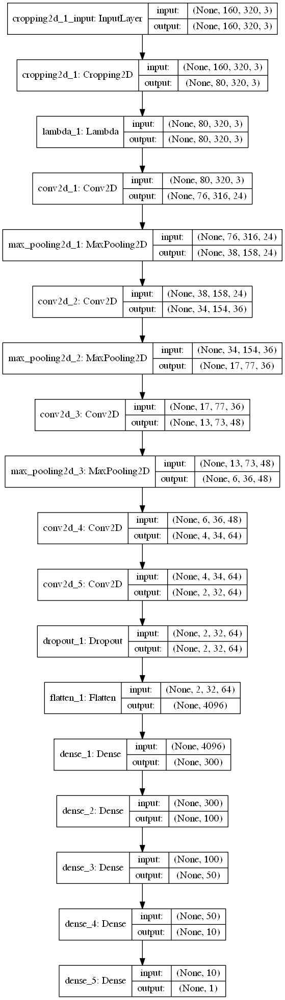

# Behavioral Cloning Project

This repository contains a deep neural network that learns how to drive a car by
replicating a human driver. Udacity provided me with a simulator that recorded 3 camera views (center, left and right)
and steering angles. After recording me driving the car on the simulator, I used a deep neural
network to train with the recorded data to mimic my behavior.

The Project
---
The goals / steps of this project are the following:
* Use the simulator to collect data of good driving behavior 
* Design, train and validate a model that predicts a steering angle from image data
* Use the model to drive the vehicle autonomously around a track in the simulator. The vehicle should remain on the road for an entire loop around the track.


Implementation
---
I used Keras to implement a deep neural network based on [PilotNet](https://arxiv.org/abs/1704.07911) from NVidia with some minor modifications:
* Added a Dropout on the last convolutional layer to reduce overfitting.
* Added an extra dense layer after the convolutional layers (because yes).

On the image below, we have the final neural net structure:




Generating training data
---
When generating training data, I did 3 laps trying to my best to drive perfectly and then I went straight testing
the neural net. I got frustrated because the car could not recover if it was driving too close from the edge of the track,
ultimately falling on the lake or going to the dirt road. Then, I tried a different approach: in addition to the
3 perfect laps, I also added one lap in which I was driving from one side of the track to the
another all the time, and another which I was always driving to the edges on turns, but then recovering and going back to the
center of the track. With this training set I've got better results. 


Data augmentation
---
To increase robustness of the training, I added some randomness on the training input:
* I randomly choose between center, right or left images. When a left or right image is chosen,
the algorithm compensates the different heading angle of the camera with a compensation factor that
I calibrated manually to 0.235.
* After choosing with image to work, the algorithm decides if it should flip the image vertically, with
a chance of 50%. This helps our algorithm to turn to any direction, because on the track we have
used, most of turns are for the left.
* Last step, the algorithm does some image augmentation processes on the image. With a 10% chance, 
the code calls a sheading function, that basically distorts the images to make curvy track segments appear more
often on the training set. After that, the code randomly changes the brightness and gamma of images, in order to
make it more resilient to light conditions and different track colors.


Training and parameter tweaks
---
My biggest frustration when training is that my car could never do one specific turn of the
circuit. It had a dirt road right in front of it, so my car aways decided that it was fine to kee
straight. I tried several strategies: Reduce the learning rate, decrese the batch size, adding more Dropout
layers... But the one that really did work for me was increasing the number of epochs to 50. Although
it looks like a lot, comparing to class neural net models and other models of students that I've found online,
I think my neural net got very resilient to overfitting because of the augmented training data that I've prepared.
The final hyperparameters values are:
````python
EPOCHS = 50
BATCH_SIZE = 8
LEARNING_RATE = 2e-5
````


Results
---
You can check the [video here](video.mp4) or on Youtube:

[](http://www.youtube.com/watch?v=RsfbBNNDjNM)

But the car can drive itself continuously on the track with this neural net and the trained sample.


Try it yourself
---
First, get the simulator [here](https://github.com/udacity/self-driving-car-sim).
Make sure you also have the carnd-term1 conda environment. More info [here](https://github.com/udacity/CarND-Term1-Starter-Kit).

To run the model, switch on the simulator, select Autonomous mode. Then run:

````bash
python drive.py model.h5
````

If you want to train the model again, run:

````bash
python model.py FOLDER_WITH_TRAINING_DATA
````


Possible improvements
---

Although results work fine for the objectives of the project, I could make this neural network more resilient if I added training data from other tracks. Also, another improvement
is to use throttle data also on the network. Another improvement I imagined is to have a recursive deep neural network,
which the steering and throttle data could be one of the inputs of one of the dense layers, thus giving the
neural network information about the previous values of steering and throttle, that I believe can be helpful for training.

